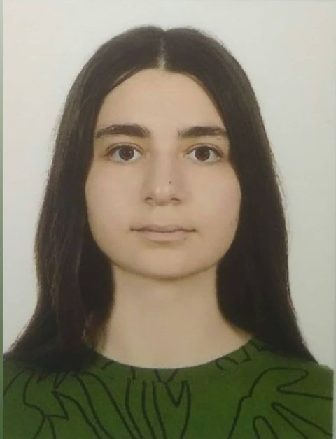
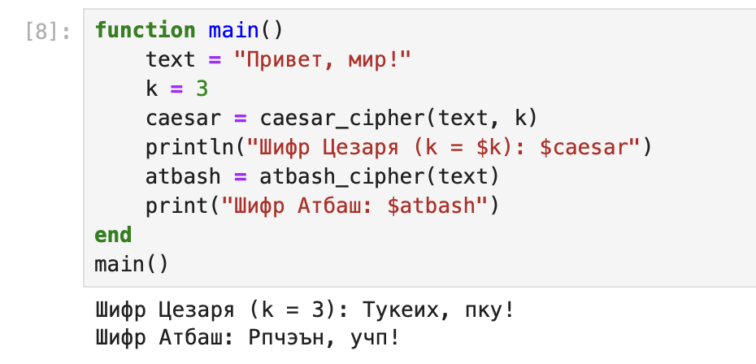

---
# Preamble

## Author
author:
  name: Бекбузарова Роза Алисхановна
  degrees: BSc
  email: 1032259352@rudn.ru
  affiliation:
    - name: Российский университет дружбы народов
      country: Российская Федерация
      postal-code: 117198
      city: Москва
      address: ул. Миклухо-Маклая, д. 6
## Title
title: "Лабораторная работы №1"
subtitle: "Шифра простой заменя"
license: "CC BY"
date: 2026-02-11
## Generic options
lang: ru-RU
crossref:
  lof-title: Список иллюстраций
  lot-title: Список таблиц
  lol-title: Листинги
## Formats
format:
### Pdf output format
  beamer:
    toc: true
    toc-title: Содержание
    number-sections: true
    colorlinks: false
    toc-depth: 2
    slide_level: 2
    aspectratio: 169
    section-titles: true
    theme: metropolis
    themeoptions: progressbar=frametitle,sectionpage=progressbar,numbering=fraction
#### Language
    babel-lang: russian
    babel-otherlangs: english
### Html output
  revealjs:
    transition: slide
    margin: 0.2
    smaller: false
    output-ext: html
    theme: beige
    logo: _resources/image/logo_rudn.png
---

# Информация

## Докладчик

:::::::::::::: {.columns align=center}
::: {.column width="70%"}

  * Кармацкий Никикта Сергеевич
  * студент группы НФИмд-01-25
  * Российский университет дружбы народов им. П. Лумумбы
  * [1032259402@rudn.ru](mailto:1032259402@rudn.ru)

:::
::: {.column width="30%"}



:::
::::::::::::::

# Введение

**Цель работы**

Основная цель работы - изучить и реализовать шифры Цезаря и Атбаш.

**Задачи**

С помощью языка программирования Julia реализовать:

- Шифр Цезаря.
- Шифр Атбаш.

# Шифр Цезаря

```julia
function caesar_cipher(text::String, k::Int)
    rusAlph = "абвгдеёжийзклмнопрстуфхцчшщъыьэюя"
    ciphered_text = []

    for symbol in text
        lower_char = lowercase(string(symbol))[1]
        if occursin(string(lower_char),rusAlph)
            alphabet_chars = collect(rusAlph)
            index =findfirst(isequal(lower_char), alphabet_chars)
            new_index = mod(index + k - 1, 33) + 1
```

# Шифр Цезаря

```julia

            if isuppercase(symbol)
                push!(ciphered_text, uppercase(alphabet_chars[new_index]))
            else
                push!(ciphered_text, alphabet_chars[new_index])
            end
        else
            push!(ciphered_text, symbol)
        end
    end

    return join(ciphered_text)
end
```

# Шифр Атбаш

```julia
function atbash_cipher(text::String)
    a = Int('а')
    ya = Int('я')
    ciphered_text = []

    for symbol in text
        ascii_symbol = Int(lowercase(symbol)[1])
        if a <= ascii_symbol <= ya
            new_letter = Char(ya - ascii_symbol + a)
```

# шифр Атбаш

```julia
            if isuppercase(symbol)
                push!(ciphered_text, uppercase(new_letter))
            else
                push!(ciphered_text, new_letter)
            end
        else
            push!(ciphered_text, symbol)
        end
    end

    return join(ciphered_text)
end
```

# Запуск кода

```julia
function main()
    text = "Привет, мир!"
    k = 3
    caesar = caesar_cipher(text, k)
    println("Шифр Цезаря (k = $k): $caesar")
    atbash = atbash_cipher(text)
    print("Шифр Атбаш: $atbash")
end
main()
```

# Результат работы программы

{#fig-001 width="70%"}

# Заключение

В результате выполнения лабораторной работы познакомились с простейшими шифрами и реализовали их на языке Julia.

# Список литературы

1. JuliaLang [Электронный ресурс]. 2024 JuliaLang.org contributors. URL: https: //julialang.org/ (дата обращения: 11.10.2024).
2. Julia 1.11 Documentation [Электронный ресурс]. 2024 JuliaLang.org contributors. URL: https://docs.julialang.org/en/v1/ (дата обращения: 11.10.2024).