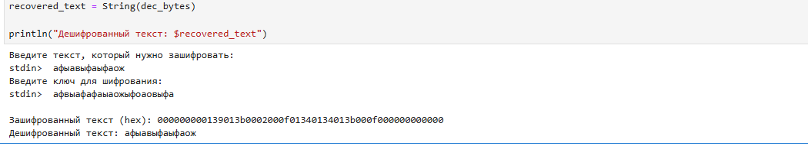

---
# Preamble

## Author
author:
  name: Бекбузарова Роза Алисхановна
  degrees: BSc
  orcid: 0000-0002-0877-7063
  email: 1032259352@pfur.ru
  affiliation:
    - name: Российский университет дружбы народов
      country: Российская Федерация
      postal-code: 117198
      city: Москва
      address: ул. Миклухо-Маклая, д. 6
## Title
title: "Лабораторная работа №3"
subtitle: "Гаммирование конечной гаммой"
license: "CC BY"
## Generic options
lang: ru-RU
number-sections: true
toc: true
toc-title: "Содержание"
toc-depth: 2
## Crossref customization
crossref:
  lof-title: "Список иллюстраций"
  lot-title: "Список таблиц"
  lol-title: "Листинги"
## Bibliography
bibliography:
  - bib/cite.bib
csl: _resources/csl/gost-r-7-0-5-2008-numeric.csl
## Formats
format:
### Pdf output format
  pdf:
    toc: true
    number-sections: true
    colorlinks: false
    toc-depth: 2
    lof: true # List of figures
    lot: true # List of tables
#### Document
    documentclass: scrreprt
    papersize: a4
    fontsize: 12pt
    linestretch: 1.5
#### Language
    babel-lang: russian
    babel-otherlangs: english
#### Biblatex
    cite-method: biblatex
    biblio-style: gost-numeric
    biblatexoptions:
      - backend=biber
      - langhook=extras
      - autolang=other*
#### Misc options
    csquotes: true
    indent: true
    header-includes: |
      \usepackage{indentfirst}
      \usepackage{float}
      \floatplacement{figure}{H}
### Docx output format
  docx:
    toc: true
    number-sections: true
    toc-depth: 2
---

# Цель работы

Цель работы -- изучить метод шифрования гаммированием с конечной гаммой и реализовать его на языке Julia.

# Задание

С помощью языка программирования Julia реализовать:

- функции преобразования байтов в шестнадцатеричную строку и обратно;
- функцию шифрования гаммированием с повторением ключа (XOR);
- программу, запрашивающую у пользователя текст и ключ, выводящую зашифрованный текст в hex и выполняющую проверку дешифрованием.

# Теоретическое введение

Гаммирование – метод симметричного шифрования, основанный на наложении на открытые данные некоторой псевдослучайной последовательности (гаммы). В качестве обратимой операции чаще всего используется побитовое сложение по модулю 2 (XOR). Если гамма конечна и повторяется, шифр называется шифром с конечной гаммой [@julialang].

Основное преимущество метода – простота реализации и высокая скорость. Недостаток – при коротком ключе возможно вскрытие частотным анализом.

# Выполнение лабораторной работы

## Вспомогательные функции

Для работы с байтами и их шестнадцатеричным представлением были реализованы две функции:

```julia
# Преобразование массива байт в hex-строку
function bytes_to_hex(bytes::Vector{UInt8})
    return join(hex.(bytes, pad=2))
end

# Преобразование hex-строки в массив байт
function hex_to_bytes(hex_str::String)
    return [parse(UInt8, hex_str[i:i+1], base=16) for i in 1:2:length(hex_str)]
end
```

## Функции шифрования и дешифрования
# Основная функция шифрования принимает массив байт данных и массив байт ключа. При необходимости ключ повторяется по циклу.

```julia
function encrypt_bytes(data::Vector{UInt8}, key::Vector{UInt8}; repeat_key=true)
    result = UInt8[]
    key_len = length(key)
    for (i, byte) in enumerate(data)
        k = key[mod1(i, key_len)]   # повтор ключа
        push!(result, byte ⊻ k)
    end
    return result
end

# Дешифрование – та же операция, так как XOR обратим
decrypt_bytes = encrypt_bytes
```

## Пример использования
Программа запрашивает у пользователя текст и ключ, выполняет шифрование и выводит результат в шестнадцатеричном виде, а затем проверяет дешифрование.

```julia
println("Введите текст, который нужно зашифровать:")
plaintext = readline()

println("Введите ключ для шифрования:")
key_str = readline()

# Преобразование строк в массивы байт
pt_bytes = collect(codeunits(plaintext))
key_bytes = collect(codeunits(key_str))

# Шифрование
cipher_bytes = encrypt_bytes(pt_bytes, key_bytes; repeat_key=true)
cipher_hex = bytes_to_hex(cipher_bytes)

println("\nЗашифрованный текст: $cipher_hex")

# Дешифрование
dec_bytes = decrypt_bytes(cipher_hex, key_bytes; repeat_key=true)
recovered_text = String(dec_bytes)

println("Дешифрованный текст: $recovered_text")
Результат работы
При запуске программы с текстом Hello, мир! и ключом key получен следующий результат (рис. @fig-001):
```

{#fig-001 width="70%"}

Как видно, дешифрованный текст полностью совпадает с исходным, что подтверждает корректность реализации.

## Выводы
В результате выполнения лабораторной работы изучен метод гаммирования с конечной гаммой и реализован на языке Julia. Программа корректно выполняет шифрование и дешифрование текстовых данных с использованием XOR и повторяющегося ключа. Полученные навыки могут быть использованы для понимания принципов работы симметричных шифров.

## Список литературы{.unnumbered}
::: {#refs}
:::

