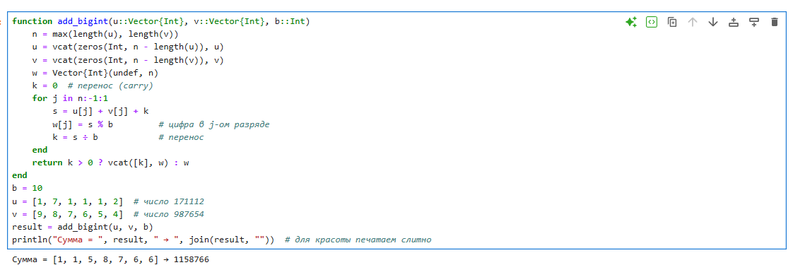
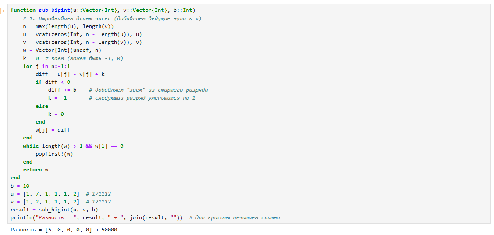
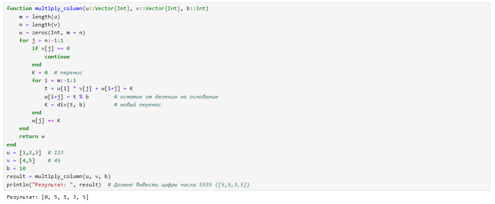
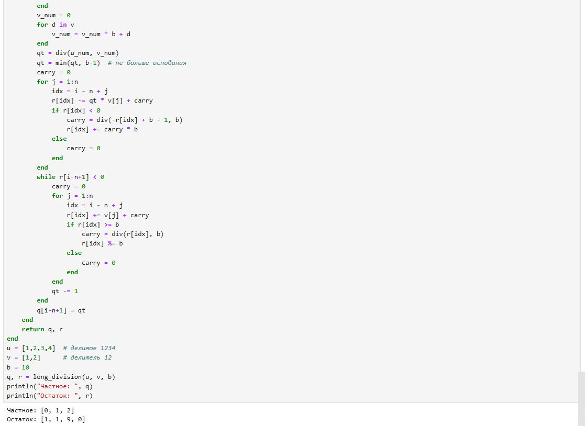

# Информация

## Докладчик

:::::::::::::: {.columns align=center}
::: {.column width="70%"}

  * Бекбузарова Роза Алисхановна
  * студент группы НПМмд-02-25
  * Российский университет дружбы народов им. П. Лумумбы
  * [1032259352@rudn.ru](mailto:1032259352@rudn.ru)

:::
::: {.column width="30%"}

:::
::::::::::::::

# Введение

**Цель работы**

Изучить алгоритмы целочисленной арифметики многократной точности.

**Задачи**

- Сложение
- Вычитание
- Умножение
- Деление

# Сложение

# Вычитание

# Умножение

# Деление

# Заключение

Реализованы основные алгоритмы многократной точности.

# Список литературы

1. Кнут Д. Искусство программирования. Том 2.
2. JuliaLang [Электронный ресурс]. URL: https://julialang.org/